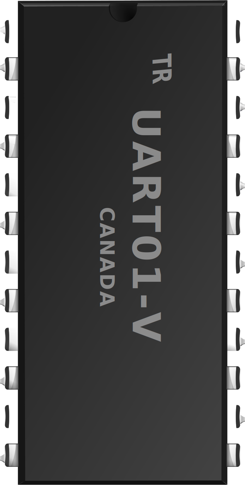
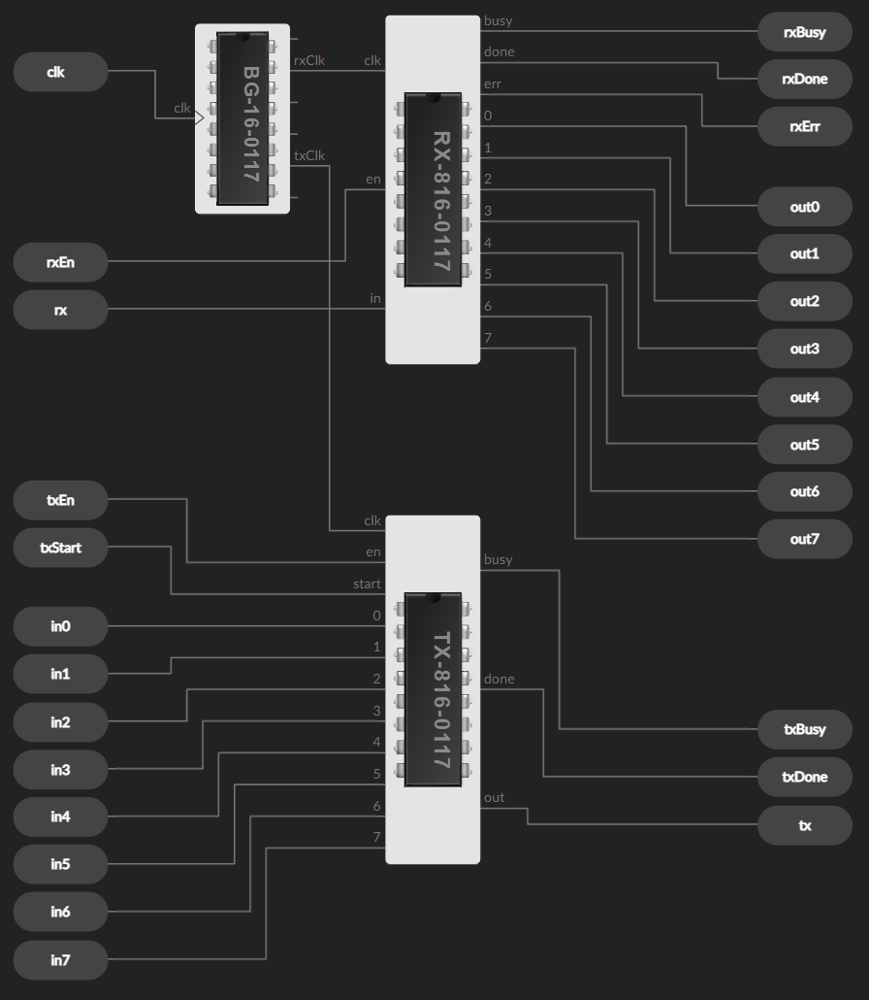
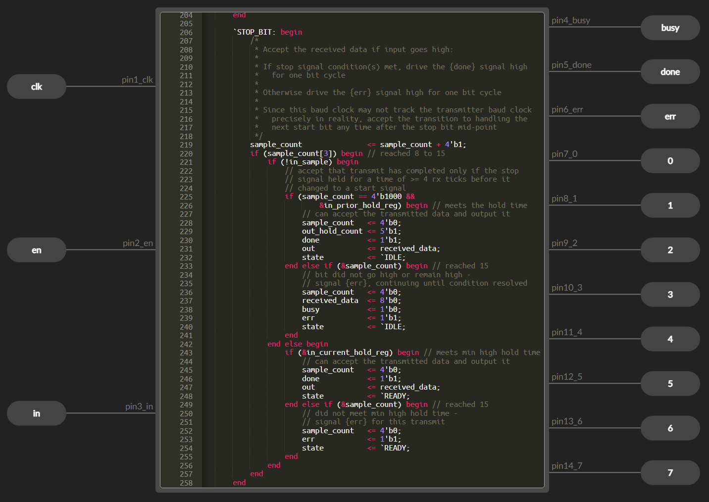

<br />

# uart-verilog

8 bit UART with tests, documentation, timing diagrams

    For simulation and Electronic Design Automation

Consists of TX module and RX module. The two modules are also downloadable in an [Icestudio][link-icestudio] .ice block, pre-packaged.

Full validation of the UART is described below in 30 tests.

## Parameters

Select the rates:
```
CLOCK_RATE = 12000000
```
```
BAUD_RATE = 115200
```
Select mode 8-N-1 or 8-N-2 (8 bits data, no parity, and 1 or 2 stop bits):
```
TURBO_FRAMES = 0   // The default 2 stop bits - more robust communication
TURBO_FRAMES = 1   // 1 stop bit - higher max bandwidth
```

## Getting Started

**The code:** See UART8.v and supporting .v files ([Uart8Transmitter.v](Uart8Transmitter.v), [Uart8Receiver.v](Uart8Receiver.v), [...](#top)).

**UART.ice block:** You can explore a hierarchical design workflow and plug this UART in your larger design:  
[ Download "`UART01-V`" device](../../releases/latest "Download UART01-V Icestudio device: releases/latest"). Then use Icestudio for virtual breadboarding (aka programming an FPGA). Screenshots below show this: It mixes graphical editing with Verilog. The editing/design environment allows you to load a hardware design onto an FPGA and be testing how the circuit functions in minutes.

**Tests section**: The tests are meant to relate the visuals (zooming in on transmission waveform in a specific context) to the Verilog (line numbers in the code). Each different behaviour is described. Understand more about UART serial transmission, learn about the UART itself & how the code works, brush up on Verilog HDL. There are sidebars about interesting or educational details, that walk you into the Verilog.

## Multi-module design of the UART

The representation of the UART in Icestudio as it's placed and wired - the details inside are always expandable:


### Inside view


### Inside view of one module


<br />

## Tests

**For reference**

[`CodeCoverageIndex.md`](tests/CodeCoverageIndex.md "CodeCoverageIndex file") · Lists all the non-trivial `if-else` branches in the code; lists tests that cover each

The reverse index of the code coverage is below: From each test the code lines are linked, and highlighted.

**Other notes**

- Red marker in each test points to where the essential action is

- The tests without .png screenshots you can easily view with GTKWave on your own copy of the repo

### Group 1 - TX module to RX module transmission

Group 1 tests use two different UART chips, with one's transmitter talking to the other's receiver. A UART chip has the two fully independent submodules so transmission can go either direction between two systems.

Test results would be identical, however, if a loopback configuration were used: testing on one chip only, connecting its `tx` pin to its `rx` pin. The equivalence is demonstrated by test variant #1a: It's the same as test #1 but with the one-chip configuration. The delta of the test bench setup can be seen here: [1.v &larr;&rarr; 1a.v](https://github.com/TimRudy/uart-verilog/compare/main...TimRudy:diff-test-1a "Compare: Test bench setup using one-chip configuration").

Group 1 traces show the communication as an integrated whole:

- Relative timing of the bits sent, synched, received

- How the Uart8Transmitter (top half) and Uart8Receiver (bottom half) each indicates when it's busy, done, or the transmission is in error: `txBusy`, `txDone`, `rxBusy`, `rxDone`, `rxErr` signals are for purpose of external control

- Result at a glance: When successful, the `out` value at bottom matches the `in` value at upper left

<br />

#### #1 One successful transmission frame

[![Test case 1][img-1-cr]][img-1]

[1.v](tests/1.v "Test bench 1.v")

**Code Coverage Refs**

`Uart8Transmitter:` [`84`](https://github.com/TimRudy/uart-verilog/blob/4a25276/Uart8Transmitter.v#L84), [`127`](https://github.com/TimRudy/uart-verilog/blob/4a25276/Uart8Transmitter.v#L127)  
`Uart8Receiver:` [`133, 134`](https://github.com/TimRudy/uart-verilog/blob/4a25276/Uart8Receiver.v#L132-L134), [`148`](https://github.com/TimRudy/uart-verilog/blob/4a25276/Uart8Receiver.v#L148), [`238`](https://github.com/TimRudy/uart-verilog/blob/4a25276/Uart8Receiver.v#L237-L238), [`269`](https://github.com/TimRudy/uart-verilog/blob/4a25276/Uart8Receiver.v#L261-L269)  

**Observations**

- `txStart` must be asserted over the time when data byte "`45`" is accepted for transmit

- `txEn` and `rxEn` must hold for the transmit and receive durations, otherwise the transmission halts in the middle

- `rxDone` is the output that can be monitored for the purpose of grabbing the `out` data "`45`", because `out` is only available for a limited time

- `in_data` is the byte of data to transmit; `received_data` is the byte being reassembled on the other side

    <details>
    <summary>But what's the reason "in_data" changes during the progression?</summary>
    <br />

    First, note signal `in` is shown at the top of tests [#4](#4--8) and following - not shown in this test. `in` is a wire by which the data, `45`, is presented to the transmitter. `in_data`, however, is a register accepting that data.

    The bits are shifted through the register (`Uart8Transmitter` ref above, line [`102`](https://github.com/TimRudy/uart-verilog/blob/4a25276/Uart8Transmitter.v#L99-L102)). When the lowest-order bit of the `5` is taken away and shifted out, what's left is `2`; the higher-order bits that form the `4` shift to follow, so what's left in that position is `2`.

    The `45` -> `22` -> `...` is just an implementation detail, but worth mentioning because the design choice does not help with understandability and transparency. Not many people will ever look at that value in `in_data`, but you are looking at it. So the reason it is shifted 8 times is that each bit is only needed once by the next stage in processing, the bits are needed in order, and that's it: They can be thrown away as the progression happens. The shift register mechanism is very practical, very no-frills for the purpose required (see comment at line [`102`](https://github.com/TimRudy/uart-verilog/blob/4a25276/Uart8Transmitter.v#L99-L102)).

    `received_data` shows it has the same implementation. Given that the lowest bit comes first in the transmission sequence, the shift implementation dictates how it needs to work: the bit shows up in the highest bit position, following which it progressively moves into place!

    </details>
    <br />

#### #2 &ndash; #3

<details>
<summary>Tolerance for mismatch in transmit, receive clocks</summary>

#### #2 Leading RX clock, correct data is read out

[2.v](tests/2.v "Test bench 2.v")

**Observations**

- Tests #2 and #3 tweak the parameter `RX_OVERSAMPLE_RATE` to distort the relation between `txClk` and `rxClk`

- By design, the frequency ratio is `1:16`, but in reality the transmitting and receiving UARTs' clocks are independent, so unsynchronized. A degree of synchronization occurs through the UART protocol, though: Every 8 bits the receiver waits and listens for the idle-to-start transition. See the idle waiting interval in other tests, for example [#4, #5](#4--8)

- The idle interval between each 8-bit packet gives a "reset" for sampling drift (from the precise middle of each bit) that may build up

<br />

#### #3 Lagging RX clock, incorrect data is read out

[3.v](tests/3.v "Test bench 3.v")

**Observations**

- `RX_OVERSAMPLE_RATE` is outside the range where the sampling of 8 bits by the receiver actually aligns with the 8 bits, so this demonstrates how communication will go wrong when two systems don't have the same UART protocol configured, or don't have the same clock rate

</details>
<br />

#### #4 &ndash; #8

<details>
<summary>Two transmission frames: Enabling, disabling and the use of "txStart" signal</summary>

#### #4 Two successful frames, second is shortened due to external reset

[![Test case 4][img-4-cr]][img-4]

[4.v](tests/4.v "Test bench 4.v")

**Code Coverage Refs**

`Uart8Transmitter:` [`127`](https://github.com/TimRudy/uart-verilog/blob/4a25276/Uart8Transmitter.v#L127)

**Observations**

- Demonstrates the indefinitely long idle time for the transmitter (while enabled): After `txBusy` and `txDone`, transmitter state is `001`

- `IDLE` state `001` is ended by the `txStart` signal being clocked in

- Receiver is very much the same, except it relies on the transmitter to wake it from `IDLE` state `001`

- Note transmitter `out` and receiver `in`/`in_sample`: The `1` value of these is known as a "mark" and it signals waiting, in a state between transmits (terminology that I use here will be "stop bit"). The drop to `0` is the signal to start receiving. Because it is not the data yet, but a fixed length pause before the data, this `0` is known as a "space" (terminology here: "start bit")

- Second transmission frame is shortened, but the cutting-off is not enough to affect the result since it's during the output. Note when `rxEn` drops to `0`: It makes the `rxDone` pulse shorter than `rxDone` in the first frame, it makes the state `101` shorter, and makes the availability of the "`7F`" data shorter

<br />

#### #5 Correct data is read out for first frame, incorrect for second due to mismatch

[5.v](tests/5.v "Test bench 5.v")

**Code Coverage Refs**

`Uart8Receiver:` [`244 (*for second frame)`](https://github.com/TimRudy/uart-verilog/blob/4a25276/Uart8Receiver.v#L244)

<br />

#### #6 Interrupted transmit followed by complete transmit

[6.v](tests/6.v "Test bench 6.v")

**Code Coverage Refs**

`Uart8Transmitter:` [`84`](https://github.com/TimRudy/uart-verilog/blob/4a25276/Uart8Transmitter.v#L84)

<br />

#### #7 Interrupted transmit followed by complete transmit ("txStart" overlaps)

[7.v](tests/7.v "Test bench 7.v")

**Code Coverage Refs**

`Uart8Transmitter:` [`84`](https://github.com/TimRudy/uart-verilog/blob/4a25276/Uart8Transmitter.v#L84)

<br />

#### #8 Interrupted transmit followed by failed transmit ("txStart" too short)

[![Test case 8][img-8-cr]][img-8]

[8.v](tests/8.v "Test bench 8.v")

</details>
<br />

#### #9 Continuous mode: Two successful transmission frames

[![Test case 9][img-9-cr]][img-9]

[9.v](tests/9.v "Test bench 9.v")

**Code Coverage Refs**

`Uart8Transmitter:` [`84`](https://github.com/TimRudy/uart-verilog/blob/4a25276/Uart8Transmitter.v#L84), [`115, 116`](https://github.com/TimRudy/uart-verilog/blob/4a25276/Uart8Transmitter.v#L115-L116), [`120`](https://github.com/TimRudy/uart-verilog/blob/4a25276/Uart8Transmitter.v#L120), [`123`](https://github.com/TimRudy/uart-verilog/blob/4a25276/Uart8Transmitter.v#L123)  
`Uart8Receiver:` [`238`](https://github.com/TimRudy/uart-verilog/blob/4a25276/Uart8Receiver.v#L237-L238), [`269`](https://github.com/TimRudy/uart-verilog/blob/4a25276/Uart8Receiver.v#L261-L269)  

**Observations**

- For this mode, `txStart` does not go low; so for each frame the `in` data just needs to be set up in time to be captured in `in_data` and transmitted

- Limit time for set-up of `in`: Before the high-going clock at the high-going `txDone`

- This trace shows a third transmit starting, because `txStart` goes low too late at the end of second transmit

- Since this trace is longer, it reveals there is a lot of clock mismatch

    <details>
    <summary>How much clock mismatch is there?</summary>
    <br />

    By the end of 8 bits, timing appears about 3.5 RX clock periods off compared to the TX clock (for the baud rate chosen for this testing, anyway).

    The mismatch comes from round-off error: It's the fault of `BaudRateGenerator`'s simplistic code; so it's implementation, not testing-related. (As such, it is a factor of the chosen baud rate.)

    </details>
    <br />

#### #10 Continuous mode, input data is set up just in time for transmit

[10.v](tests/10.v "Test bench 10.v")

**Observations**

- The second transmit data `in` is set up just before the data capture; #9 shows earlier in the same clock cycle

<br />

#### #11 Continuous mode, input data is not set up in time

[11.v](tests/11.v "Test bench 11.v")

**Observations**

- Unlike in #9 and #10, the second `in` data byte "`B1`" lags; at the moment of the high-going `txDone`, the previous `in` value is re-captured in `in_data`

- Shows a third transmit starting, because `txStart` goes low too late at the end of second transmit

- This test bench uses a feedback method of control to shut off `txStart`; so it's suggestive of the idea of external control of the UART; but these tests do not go into how you can use outputs for external control, nor how to decide the timing of inputs

- In general, the test benches rely on tuned timings to present the inputs according to the intent of the test - in other words, empirical or ad hoc timings. Examples to illustrate:

  - Interval `#11500` used in test [#13](#13--15): Because each cycle is about 11.5ms, this gives prep or set-up times that land mid-way through each transmit for pushing each next byte (observe the `in` transitions relative to the `txDone` pulses)
  - Compare `#10750` used in test [#14](#13--15), because its cycles are shorter

<br />

#### #12 Continuous mode: 8-N-1 (TURBO_FRAMES = 1)

[![Test case 12][img-12-cr]][img-12]

[12.v](tests/12.v "Test bench 12.v")

**Code Coverage Refs**

`Uart8Transmitter:` [`115, 116`](https://github.com/TimRudy/uart-verilog/blob/4a25276/Uart8Transmitter.v#L115-L116), [`118`](https://github.com/TimRudy/uart-verilog/blob/4a25276/Uart8Transmitter.v#L118)  
`Uart8Receiver:` [`79`](https://github.com/TimRudy/uart-verilog/blob/4a25276/Uart8Receiver.v#L79), [`282`](https://github.com/TimRudy/uart-verilog/blob/4a25276/Uart8Receiver.v#L282)  

**Observations**

- Here the UART is instantiated with parameter `TURBO_FRAMES = 1`, and it means the transmitter sends a "stop bit" of the duration of 1 bit rather than duration 2 bits

- Documentation for the `8-N-1`, `8-N-2` modes: See `Uart8Transmitter` [`header`](https://github.com/TimRudy/uart-verilog/blob/4a25276/Uart8Transmitter.v#L22-L38 "Header comments about 8-N-1, 8-N-2")

- This mode `8-N-1` provides the maximum bandwidth: It's an effective data rate of 80% over the serial line, because 10 bits are transmitted for each 8-bit packet

- But I gave the Verilog code a default of `8-N-2`, `TURBO_FRAMES = 0`, because it fits the project's purpose, namely: simulation & testing, either for the UART's own sake or to support other projects in development; and also: education, visualization. So by default, the UART might as well be more bullet-proof in use; if you are getting specific about your use case, then you'll set the parameters

- The Verilog that implements the `TURBO_FRAMES` feature (see `Uart8Transmitter` refs above), deserves a note for the reader

    <details>
    <summary>Not 100% transparent Verilog implementation</summary>
    <br />

    The [code](https://github.com/TimRudy/uart-verilog/blob/4a25276/Uart8Transmitter.v#L112-L130 "Transmitter code for `STOP_BIT` state: `TURBO_FRAMES`") for `STOP_BIT` state waits in that state for either `1` tick or `2` - but how, and why, is it using that `done` variable?

    You need to know the meaning of "`<=`", in context, in procedural block code.

    Specifically, `done <= 1'b1;` appears to do something, but remember, its change to the value is not applied till the end of the time slice; consequently, the code after it `if (done == 1'b0)` is referring to the value at the current time *before* `done` is changed at all; so it is not a mistake!

    The code `done <= 1'b0;` in the same block is simply contradicting (overriding) the prior `done <= 1'b1;` which is (was) pending. ...So you see that that makes perfect sense as well!

    Those are hints to reveal how the `if-else` code works to introduce a single-clock-tick delay (that is, an extra one). The logic could present itself more clearly if there was a separate new variable, or another state, but for convenience and economy it uses variable `done` that is boolean and is already at hand.

    </details>
    <br />

#### #13 &ndash; #15

<details>
<summary>Twenty transmission frames continuous mode: 8-N-1, 8-N-2</summary>

#### #13 TURBO_FRAMES = 0

[![Test case 13][img-13-cr]][img-13]

[13.v](tests/13.v "Test bench 13.v")

**Code Coverage Refs**

`Uart8Transmitter:` [`120`](https://github.com/TimRudy/uart-verilog/blob/4a25276/Uart8Transmitter.v#L120), [`123`](https://github.com/TimRudy/uart-verilog/blob/4a25276/Uart8Transmitter.v#L123)

<br />

#### #14 TURBO_FRAMES = 1

[![Test case 14][img-14-cr]][img-14]

[14.v](tests/14.v "Test bench 14.v")

**Observations**

- The differences between #13 and #14 are seen in:

  - `out` of the transmitter: The narrowing of the high (stop) signal which is the pulse directly below each `txDone` pulse
  - `rxBusy` of the receiver: The disappearance of the one-tx-clock-period `IDLE` state
  - Completion, at the red marker, about 1.5ms earlier

<br />

#### #15 TURBO_FRAMES = 1, two transmissions are lost due to clock mismatch

[![Test case 15][img-15-cr]][img-15]

[15.v](tests/15.v "Test bench 15.v")

**Observations**

- Input byte "`99`" misses its deadline; however, it is still present at the input for next data capture, so it is transmitted

- The bytes after it are all accounted for, synchronously, until byte "`7`" misses its deadline

- This shows the virtue of limiting the length of bursts of data sent with this simple protocol; if each burst in this test were 8 bytes (frames), followed by driving the `txStart` signal low to go on to the next burst, then there would have been no data errors (*note this is an extreme example though - 9 bytes for the sync to go off)

- There is no `rxErr` signal for this scenario because there is no breach of the protocol

</details>
<br />
<br />

### Group 2 - RX module

Group 2 tests are for the receiver RX part of the UART.

The TX module is fairly deterministic, and it's been tested by all the transmits of the Group 1 scenarios.

The RX module has a tougher job, because it receives an arbitrary signal pattern as input and must make sense of it. It must lock on to accept good serial data (a frame), or otherwise must reject a data stream if the data doesn't start cleanly from a baseline signal, or if it doesn't end in the accepted way to certify it's well-formed.

These test signals don't have to come from a well-behaved or realistic TX module. You could consider them from a potentially "malicious" transmitter.

To note: If the protocol requirements are not met, and the output isn't the 8-bit byte expected, then the output can include an error signal or can just be garbled data.

So, these tests are fine-grained in order to nail down the behaviour of the RX device by exploring the range of signal waveforms possible (mainly the variety of timings; and the signal held low when it should revert to high or vice versa; in addition, high-low or low-high glitches). Variants of tests are necessary to do this. I named files with an "a" suffix, like #18a.v, when they were used to explore changed waveforms - over a range related to that test - to keep them separate from the canonical test.

<br />

#### #16 Transmit start is recognized because rx signal was high for minimum 4 ticks

[![Test case 16][img-16-cr]][img-16]

[16.v](tests/16.v "Test bench 16.v")

**Code Coverage Refs**

`Uart8Receiver:` [`134`](https://github.com/TimRudy/uart-verilog/blob/4a25276/Uart8Receiver.v#L132-L134)

**Observations**

- Look at `in_sample` rather than `rx`. `rx` is the external signal to the Device Under Test; `in_sample` tracks/follows it, but it's in a register. So the latter is the reference: All subsequent or coincident signal changes are tied to it

- `clk` in these traces is `rxClk` (16x higher frequency than the `txClk` of this communication)

<br />

#### #17 Transmit start is not recognized because rx signal was not high for 4 ticks

[![Test case 17][img-17-cr]][img-17]

[17.v](tests/17.v "Test bench 17.v")

**Code Coverage Refs**

`Uart8Receiver:` [`141`](https://github.com/TimRudy/uart-verilog/blob/4a25276/Uart8Receiver.v#L141)

**Observations**

- Here's an example of the `err` signal turning on (`err` is `rxErr`)

- The device is in state `001` the whole time; after `err` clears, it's ready to go on, to start receiving data

- Look at the `Uart8Receiver` code ref to see where and why `err` is signaled; at around the same place in the code, you'll see the condition under which it's cleared

  <details>
  <summary>Some Verilog hints to understand the code</summary>
  <br />

  The "`&`" operator of "`&in_prior_hold_reg`" collects all the bits, and the expression is true if they're all `1`. Secondly, `in_prior_hold_reg` is a vector of size `4`, and is a shift register. So it provides a connection to time passing: `4` ticks of the clock for it to fill up (say with `1`s).

  Ticks of the clock are implicitly being examined, and waited for, by this section of code: `4` ticks, `8` ticks, `12` ticks; and `16` ticks is the nominal duration of an incoming bit being sampled. If you understand line [`152`](https://github.com/TimRudy/uart-verilog/blob/4a25276/Uart8Receiver.v#L152): `sample_count <= 4'b0100;` and how `sample_count` is being used cycling from `0` to `F`, then you've understood a lot of the code and the protocol, and how a Finite State Machine is useful.

  When `in_sample` drops to `0`, that's the trigger for recovering from the error: `in_prior_hold_reg` is losing its `1` bits and goes away from the `F` or "`&in_prior_hold_reg`" condition; `sample_count`, if it continues to increase, will allow moving from the `IDLE` state to `START_BIT` state.

  </details>
  <br />

#### #18 Transmit start fails because rx signal goes high too early

[![Test case 18][img-18-cr]][img-18]

[18.v](tests/18.v "Test bench 18.v")

**Code Coverage Refs**

`Uart8Receiver:` [`134`](https://github.com/TimRudy/uart-verilog/blob/4a25276/Uart8Receiver.v#L134), [`158`](https://github.com/TimRudy/uart-verilog/blob/4a25276/Uart8Receiver.v#L158)

**Observations**

- Compared to #17, it's a different condition, a different code branch that turns on the `err` signal

- Note below and in some other tests a "variant" test bench is included:

  - This was used to plug in different wait-time numbers, basically a range of timings for this specific signal and transition that's being tested; the process can find and go beyond the threshold where the response changes
  - The variation can be down to individual clock ticks, because exactitude is needed if there's any doubt or there could be "off-by-one" errors (*there are examples later of single-clock-tick issues & fixes; I'm particularly thinking of #20 and [#28, #29, #30](#25--30))
  - (I also made variations to test benches to switch input values, `1` to `0` etc.; for example, when a `0` is lined up as first bit after the "start" bit or a `1` is lined up as last bit before the "stop" bit, these are edge cases needing to be tested)

**Variant #18a**

- Focuses on the high in `IDLE` state after a false "start" bit (the signal has gone high too early)

- `18a.v` line [`63`](https://github.com/TimRudy/uart-verilog/blob/4a25276/tests/18a.v#L63 "Test bench changes at line 63"): &ensp;&ensp;`#230` is too short | `#250` meets the minimum | `#300` long

<br />

#### #19 Transmit start fails because rx signal goes low-high-low

[19.v](tests/19.v "Test bench 19.v")

**Code Coverage Refs**

`Uart8Receiver:` [`158`](https://github.com/TimRudy/uart-verilog/blob/4a25276/Uart8Receiver.v#L158)

**Observations**

- Start is recognized at the time a high signal eventually holds for a full `4` ticks; then `err` is cleared

- As in #17 and #18, the test ends in `IDLE` state, looking to proceed after the low signal holds for `12` ticks

<br />

#### #20 Transmit stop is recognized after rx signal goes high-low-high then is stable

[![Test case 20][img-20-cr]][img-20]

[20.v](tests/20.v "Test bench 20.v")

**Code Coverage Refs**

`Uart8Receiver:` [`215`](https://github.com/TimRudy/uart-verilog/blob/4a25276/Uart8Receiver.v#L215), [`238`](https://github.com/TimRudy/uart-verilog/blob/4a25276/Uart8Receiver.v#L237-L238)

**Observations**

- Stop bit recognition and the associated transition to next frame is the most complicated logic, so numerous tests are devoted to it

- Some of the issues:

  1. Allowed detection time of the `1` has double requirement: must be half way into the nominal sample period or `>= 8` clock ticks (see `sample_count` at red marker); and has had continuous hold time of `>= 4` ticks (see `in_sample` at red marker).

  2. The stop bit signal doesn't have a defined length. That's because the start bit `0` following the stop bit `1` - "space" following "mark" - **defines** the start of a next frame. The code has to be able to respond to the drop to `0` ("`!in_sample`") from multiple locations, and this may lie within any of the 3 states: `STOP_BIT`, `READY` or `IDLE`.

  3. Raising the "`done`" signal plus "`out`" signal - or alternatively an "`err`" signal - then sustaining the signal is the purpose of the `READY` state. But this timed functionality is actually decoupled from the state somewhat; that's because of the overlap of handling the start bit while simultaneously signaling (see line [`282`](https://github.com/TimRudy/uart-verilog/blob/4a25276/Uart8Receiver.v#L282-L289) for this - observe the use of a second counter).

- The reader can explore the meaning of splitting `in_current_hold_reg` from `in_prior_hold_reg`

    <details>
    <summary>Interesting Verilog code down to the clock tick</summary>
    <br />

    These "current"/"prior" variables are views into the register that stores the most recent `in` signal values/changes. Picture a shift register that keeps the 4 most recent values: This information is the look-back that allows for signal hold time checks, up to length 4.

    Line [`238`](https://github.com/TimRudy/uart-verilog/blob/4a25276/Uart8Receiver.v#L238) is the only place `in_current_hold_reg` is used.

    At the red marker on the trace: The logic decision for state transition can and should be made **at** the fourth tick, and the value seen by `in_current_hold_reg` is `F`; compare `in_prior_hold_reg`.

    For the other logic (2 locations in the code), `in_prior_hold_reg` does the correct job checking the hold time, when it reaches `F`.

    </details>
    <br />

**Variant #20a**

<br />

#### #21 Transmit stop is recognized after rx signal goes high-low-high past tick 8

[![Test case 21][img-21-cr]][img-21]

[21.v](tests/21.v "Test bench 21.v")

**Code Coverage Refs**

`Uart8Receiver:` [`215, 216`](https://github.com/TimRudy/uart-verilog/blob/4a25276/Uart8Receiver.v#L215-L216), [`238`](https://github.com/TimRudy/uart-verilog/blob/4a25276/Uart8Receiver.v#L237-L238)

**Variant #21a**

<br />

#### #22 Transmit fails because rx signal goes high too late, after tick 8

[![Test case 22][img-22-cr]][img-22]

[22.v](tests/22.v "Test bench 22.v")

**Code Coverage Refs**

`Uart8Receiver:` [`215, 216`](https://github.com/TimRudy/uart-verilog/blob/4a25276/Uart8Receiver.v#L215-L216), [`244`](https://github.com/TimRudy/uart-verilog/blob/4a25276/Uart8Receiver.v#L244)

**Variant #22a**

<br />

#### #23 Transmit fails because rx signal does not go high; error state begins

[23.v](tests/23.v "Test bench 23.v")

**Code Coverage Refs**

`Uart8Receiver:` [`228`](https://github.com/TimRudy/uart-verilog/blob/4a25276/Uart8Receiver.v#L228)

<br />

#### #24 Error state holds as long as rx signal has never gone high

[24.v](tests/24.v "Test bench 24.v")

**Code Coverage Refs**

`Uart8Receiver:` [`134`](https://github.com/TimRudy/uart-verilog/blob/4a25276/Uart8Receiver.v#L132-L134), [`141`](https://github.com/TimRudy/uart-verilog/blob/4a25276/Uart8Receiver.v#L141)

**Observations**

- This test covers an edge case of the `err` tests #17, #18 and #19

<br />

#### #25 &ndash; #30

<details>
<summary>Transition between two frames: Overlap of done and error signals</summary>

#### #25 Next transmit frame starts after rx signal was high for minimum 8 ticks

[![Test case 25][img-25-cr]][img-25]

[25.v](tests/25.v "Test bench 25.v")

**Code Coverage Refs**

`Uart8Receiver:` [`79`](https://github.com/TimRudy/uart-verilog/blob/4a25276/Uart8Receiver.v#L79), [`220`](https://github.com/TimRudy/uart-verilog/blob/4a25276/Uart8Receiver.v#L215-L221)

**Observations**

- Shows `done` sustained for `16`-tick cycle, and this overlaps with the next frame start

- Passes the condition at line [`134`](https://github.com/TimRudy/uart-verilog/blob/4a25276/Uart8Receiver.v#L134), immediately on entry to `IDLE` state

<br />

#### #26 Successful transmit done signal overlaps with next transmit start error

[![Test case 26][img-26-cr]][img-26]

[26.v](tests/26.v "Test bench 26.v")

**Code Coverage Refs**

`Uart8Receiver:` [`79`](https://github.com/TimRudy/uart-verilog/blob/4a25276/Uart8Receiver.v#L79), [`158`](https://github.com/TimRudy/uart-verilog/blob/4a25276/Uart8Receiver.v#L158), [`220`](https://github.com/TimRudy/uart-verilog/blob/4a25276/Uart8Receiver.v#L215-L221)

**Observations**

- The `done` signal counts out to `16` as required

- `err`, caused during the next transmit start, overlaps and actually ends before `done` ends

<br />

#### #27 Next transmit frame start overlaps with previous frame done signal

[27.v](tests/27.v "Test bench 27.v")

**Code Coverage Refs**

`Uart8Receiver:` [`238`](https://github.com/TimRudy/uart-verilog/blob/4a25276/Uart8Receiver.v#L237-L238), [`261`](https://github.com/TimRudy/uart-verilog/blob/4a25276/Uart8Receiver.v#L261), [`282`](https://github.com/TimRudy/uart-verilog/blob/4a25276/Uart8Receiver.v#L282)

**Observations**

- Shows going to the `READY` state, but only remaining in that state for a few clock ticks; whereupon the next frame starts

- Despite the transition from `READY` to `IDLE` state, `done` is sustained for a `16`-tick cycle; this is implemented by moving the value in `sample_count` over to `out_hold_count` (line `287`)

- At line [`287`](https://github.com/TimRudy/uart-verilog/blob/4a25276/Uart8Receiver.v#L287), the value assigned to `out_hold_count` tracks whatever `sample_count` has gone up to by that time - It does not use `sample_count <= 4'b1;` from the previous line, for the reason explained above about a value not changing till the end of a time slice, in procedural block code

**Variant #27a**

<br />

#### #28 Next transmit frame start overlaps with previous frame done signal 2

[28.v](tests/28.v "Test bench 28.v")

**Code Coverage Refs**

`Uart8Receiver:` [`274`](https://github.com/TimRudy/uart-verilog/blob/4a25276/Uart8Receiver.v#L274)

**Observations**

- Shows a complete `READY` state of exactly `16` ticks; whereupon the next frame starts

- At the red marker when `sample_count` is `E`, nothing happens

- In this particular case `in_sample` drops to `0` between `E` and `F`

- When `sample_count` is `F`, the assignments after line [`274`](https://github.com/TimRudy/uart-verilog/blob/4a25276/Uart8Receiver.v#L274-L281) are what start the next frame, and they start the `IDLE` state, and the "start" bit hold check of counting `12` ticks

- If you follow further: In the `IDLE` state, the condition at line `132` holds, the condition at line `133` does not hold, and so the counting continues in the branch at line `146`

- The logic fix for getting #28 working properly impacted some of the traces - the change was non-functional, only to an internal signal: a transit through `RESET` state was eliminated. Which I liked. This delta for test #1 shows this change, at `state` at the red marker: [1_cee44e1.png &larr;&rarr; 1.png](https://github.com/TimRudy/uart-verilog/compare/main...TimRudy:diff-test-1_cee44e1 "Compare: Logic fix at transition from `READY` to `IDLE`"). (Nice, right?!)

<br />

#### #29 Successful transmit done signal overlaps with next transmit start error 2

[29.v](tests/29.v "Test bench 29.v")

**Code Coverage Refs**

`Uart8Receiver:` [`238`](https://github.com/TimRudy/uart-verilog/blob/4a25276/Uart8Receiver.v#L237-L238), [`261`](https://github.com/TimRudy/uart-verilog/blob/4a25276/Uart8Receiver.v#L261), [`282`](https://github.com/TimRudy/uart-verilog/blob/4a25276/Uart8Receiver.v#L282)

**Observations**

- Shows a `READY` state of exactly `1` tick, because `in_sample` drops to `0` at the same tick that `READY` state is entered

- The `done` signal counts out to `16` as required

- `err`, caused during the next transmit start, overlaps; duration of `err` is unconstrained and it continues past the `done` signal

**Variant #29a**

<br />

#### #30 Transmit fails, error state is continuous with next transmit start error

[30.v](tests/30.v "Test bench 30.v")

**Code Coverage Refs**

`Uart8Receiver:` [`290, 293`](https://github.com/TimRudy/uart-verilog/blob/4a25276/Uart8Receiver.v#L290-L293)

**Observations**

- Shows `err` sustained high; we don't want a glitch low-high (`RESET` state), since the `busy` state signal is continuing high

- Test #30 is the unique test for this glitch low-high behaviour, meaning it wouldn't have been seen and caught in other transitions from `READY` to `IDLE`

- With that thought, I leave an exercise for the reader: Determine if there should have been, and will be, a test #31

</details>
<br />

### Running the tests on your machine

<details>
<summary>Run Icarus Verilog and GTKWave</summary>
<br />

The test benches can be run using the open source simulator Icarus Verilog: [Installation][link-iverilogi], [Getting Started][link-iverilogs].

With it installed, you can run a command like the following that specifies the required input files and one output file (.vvp):

    > iverilog -g2012 -I.. -osimout.vvp -D"DUMP_FILE_NAME=\"1.vcd\"" 1.v

&ensp;&ensp;(This is run in the "tests" directory, and ".." thus references the device .v files or .vh files at root level.)

It then requires a second step: Run the Icarus Verilog simulator/runtime to store all signal and timing data to a .vcd file (viewable signal trace):

    > vvp simout.vvp

I combine these:

    > iverilog -g2012 -I.. -osimout.vvp -D"DUMP_FILE_NAME=\"1.vcd\"" 1.v && timeout 1 >NUL && vvp simout.vvp

Also, here's the complete batch that runs all tests: [RunAllTests.txt](tests/RunAllTests.txt).

GTKWave viewer is used to view the trace (waveforms): [Installation][link-gtkwavei], [Getting Started][link-gtkwaves].

</details>
<br />
<br />

[Top](#top)

[To top of Tests](#tests)

## <!-- -->

## Topics: Device and circuit simulation

- [HDLs][link-web-hdls] · Hardware Description Languages
- [EDA][link-web-eda] · Electronic Design Automation
- [FPGAs][link-web-fpgas] · Field-Programmable Gate Arrays

## Related open source technology

[IceChips][link-icechips] devices of the 7400 TTL family

[Icestudio][link-icestudio] and Apio built on top of IceStorm, Yosys, nextpnr

[Yosys][link-yosys] synthesis by Claire Wolf

[Icarus Verilog][link-iverilog] simulator by Stephen Williams

[GTKWave][link-gtkwavei] for viewing waveforms

## <!-- -->

© 2022-2023 Tim Rudy

[img-1]: tests/images/1.png "Test case 1"
[img-1-cr]: tests/images/1-cr.png
[img-4]: tests/images/4.png "Test case 4"
[img-4-cr]: tests/images/4-cr.png
[img-8]: tests/images/8.png "Test case 8"
[img-8-cr]: tests/images/8-cr.png
[img-9]: tests/images/9.png "Test case 9"
[img-9-cr]: tests/images/9-cr.png
[img-12]: tests/images/12.png "Test case 12"
[img-12-cr]: tests/images/15-cr.png
[img-13]: tests/images/13.png "Test case 13"
[img-13-cr]: tests/images/13-cr.png
[img-14]: tests/images/14-timesync.png "Test case 14"
[img-14-cr]: tests/images/14-cr.png
[img-15]: tests/images/15.png "Test case 15"
[img-15-cr]: tests/images/15-cr.png
[img-16]: tests/images/16.png "Test case 16"
[img-16-cr]: tests/images/16-cr.png
[img-17]: tests/images/17.png "Test case 17"
[img-17-cr]: tests/images/17-cr.png
[img-18]: tests/images/18.png "Test case 18"
[img-18-cr]: tests/images/18-cr.png
[img-20]: tests/images/20.png "Test case 20"
[img-20-cr]: tests/images/20-cr.png
[img-21]: tests/images/21.png "Test case 21"
[img-21-cr]: tests/images/21-cr.png
[img-22]: tests/images/22.png "Test case 22"
[img-22-cr]: tests/images/22-cr.png
[img-25]: tests/images/25.png "Test case 25"
[img-25-cr]: tests/images/25-cr.png
[img-26]: tests/images/26.png "Test case 26"
[img-26-cr]: tests/images/26-cr.png
[link-icechips]: https://github.com/TimRudy/ice-chips-verilog
[link-icestudio]: https://icestudio.io
[link-web-hdls]: https://www.google.com/search?q=Hardware+Description+Languages
[link-web-eda]: https://www.google.com/search?q=Electronic+Design+Automation
[link-web-fpgas]: https://www.google.com/search?q=Field-Programmable+Gate+Arrays
[link-yosys]: https://github.com/YosysHQ/yosys
[link-iverilog]: http://iverilog.icarus.com
[link-iverilogi]: https://steveicarus.github.io/iverilog/usage/installation.html
[link-iverilogs]: https://steveicarus.github.io/iverilog/usage/getting_started.html
[link-gtkwavei]: http://gtkwave.sourceforge.net
[link-gtkwaves]: https://gtkwave.sourceforge.net/gtkwave.pdf
